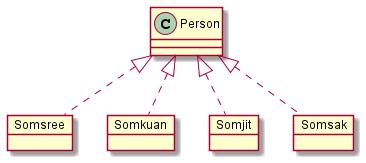

# Assignment
 Assignment นี้เป็นการรวม Assignment ของเนื้อหาในสองสัปดาห์ที่เรียนเรื่อง Abstraction  


----
## 1. ให้นำโค้ดต่อไปนี้ไป render ให้เป็น class diagram แล้วนำผลที่ได้มาใส่ใน markdown##
   
   a. ใช้โปรแกรม plantUML บนเว็บ

   b. ใช้ extension ใน VScode
   
   c. ใช้โปรแกรม PlantUML.jar ที่ดาวน์โหลดมาทำงานแบบ offline บนเครื่องของนักศึกษาเอง

### 1.1 Code ของตัวอย่างที่ 3 (สไลด์ที่ 19) ###


#### ผลที่ได้จากการ render สไลด์ 19 ####


### 1.2 Code ของตัวอย่าง ปรับปรุงการทำ Classification ของหมาและแมว (สไลด์ที่ 20) ###


#### ผลที่ได้จากการ render สไลด์ 20 ####


#### หมายเหตุ การใช้ลูกศรสามเหลี่ยมที่มีหัวโปร่งใสคือการทำ Inheritance ####


### 1.3 Classification ของ class คน (สไลด์ที่ 21) ###


#### ผลที่ได้จากการ render สไลด์ 21 ####


#### หมายเหตุ การใช้ลูกศรสามเหลี่ยมที่มีหัวโปร่งใสและเส้นประคือการทำ Instantiation (สร้างวัตถุ) ####


### 1.4 การสร้างวัตถุจาก Class คน  (สไลด์ที่ 22) ###


#### ตัวอย่างผลที่ได้จากการ render สไลด์ 22 ####




--- 
## 2. ให้แก้ไข code ไฟล์ puml เพื่อให้ได้ภาพตามสไลด์ต่อไปนี้  ##

### 2.1 สไลด์หมายเลข 44 ###

``` puml
@startuml 
class classroom{}
class Whiteboard{}
class Table{}
class Chair{}
class Student{}
class Teacher{}
' Todo: ทำให้สมบูรณ์


@enduml 
```

### 2.2 สไลด์หมายเลข 45 ###

``` puml
@startuml 
class MotorBoat{}
class Car{}
class Helm{}
class Engine{}
class Door{}
class Wheel{}
class SteeringWheel{}
' Todo: ทำให้สมบูรณ์


@enduml 
```

### 2.3 สไลด์หมายเลข 51 ###

``` puml
@startuml 

class Car{}
class Engine{}
class Wheel{}
class AirConditionner{}

Car <|-- "1..1" Engine
Car <|-- "2..4" Door
' Todo: ทำให้สมบูรณ์


@enduml 
```

#### หมายเหตุ การเขียน cardinality ทำได้โดยใช้รูปแบบดังต่อไปนี้ ####


ซึ่งจะได้ไดอะแกรมดังรูป


### 2.4 Aggregation ของคลาส หนังสือ  (สไลด์หมายเลข 54) ###

``` puml
@startuml 

class Book{}
class Cover{}
Book <|-- "2..2" Cover
' Todo: ทำให้สมบูรณ์


@enduml 
```

### 2.5 เพิ่ม Attribute และ Method ให้กับ Class หนังสือ   (สไลด์หมายเลข 56) ###

``` puml
@startuml 

class Book{
    - ISBN 
    - Name
    + Read()
    + Print()
}
 
' Todo: ทำให้สมบูรณ์


@enduml 
```


### 2.6 ใช้ plantUML วาดภาพตาม สไลด์หมายเลข 71 ###


### 2.7 ใช้ plantUML วาดภาพตาม สไลด์หมายเลข 76 ###


### 2.8 ใช้ plantUML วาดภาพตาม สไลด์หมายเลข 78 ###


### 2.9 ใช้ plantUML วาดภาพตาม สไลด์หมายเลข 95 ###


---
