# Assignment
 Assignment นี้เป็นการรวม Assignment ของเนื้อหาในสองสัปดาห์ที่เรียนเรื่อง Abstraction  

----
## 1. ให้นำโค้ดต่อไปนี้ไป render ให้เป็น class diagram แล้วนำผลที่ได้มาใส่ใน markdown##
   
   a. ใช้โปรแกรม plantUML บนเว็บ

   b. ใช้ extension ใน VScode
   
   c. ใช้โปรแกรม PlantUML.jar ที่ดาวน์โหลดมาทำงานแบบ offline บนเครื่องของนักศึกษาเอง

### 1.1 Code ของตัวอย่างที่ 3 (สไลด์ที่ 19) ###

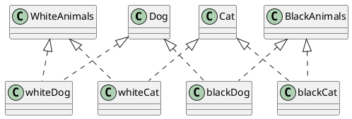

#### ผลที่ได้จากการ render สไลด์ 19 ####

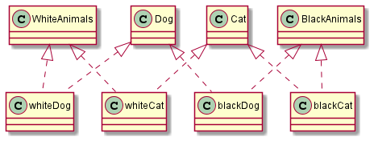

^^^ บันทึกผลของนักศึกษาลงไปแทนภาพนี้

### 1.2 Code ของตัวอย่าง ปรับปรุงการทำ Classification ของหมาและแมว (สไลด์ที่ 20) ###

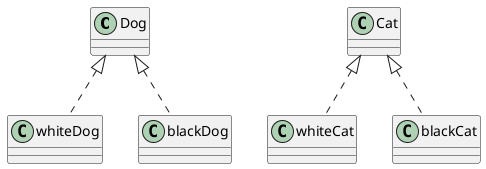

#### ผลที่ได้จากการ render สไลด์ 20 ####

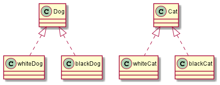

^^^ บันทึกผลของนักศึกษาลงไปแทนภาพนี้

#### หมายเหตุ การใช้ลูกศรสามเหลี่ยมที่มีหัวโปร่งใสคือการทำ Inheritance ####

### 1.3 Classification ของ class คน (สไลด์ที่ 21) ###

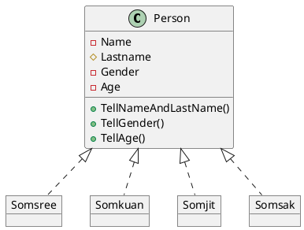

#### ผลที่ได้จากการ render สไลด์ 21 ####

^^^ บันทึกผลของนักศึกษาลงไปแทนภาพนี้

#### หมายเหตุ การใช้ลูกศรสามเหลี่ยมที่มีหัวโปร่งใสและเส้นประคือการทำ Instantiation (สร้างวัตถุ) ####

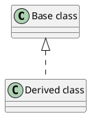

### 1.4 การสร้างวัตถุจาก Class คน  (สไลด์ที่ 22) ###

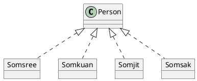
#### ตัวอย่างผลที่ได้จากการ render สไลด์ 22 ####

--- 
## 2. ให้แก้ไข code ไฟล์ puml เพื่อให้ได้ภาพตามสไลด์ต่อไปนี้  ##

### 2.1 สไลด์หมายเลข 44 ###

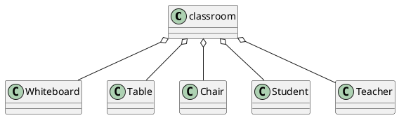

### 2.2 สไลด์หมายเลข 45 ###

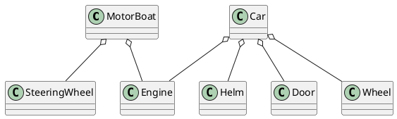

### 2.3 สไลด์หมายเลข 51 ###

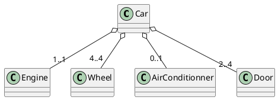

#### หมายเหตุ การเขียน cardinality ทำได้โดยใช้รูปแบบดังต่อไปนี้ ####

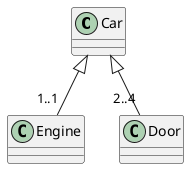
ซึ่งจะได้ไดอะแกรมดังรูป

### 2.4 Aggregation ของคลาส หนังสือ  (สไลด์หมายเลข 54) ###

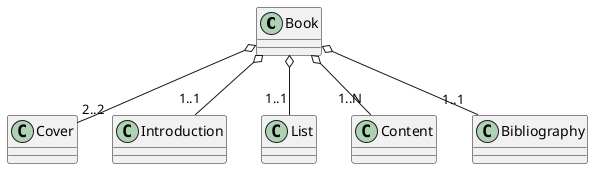

### 2.5 เพิ่ม Attribute และ Method ให้กับ Class หนังสือ   (สไลด์หมายเลข 56) ###

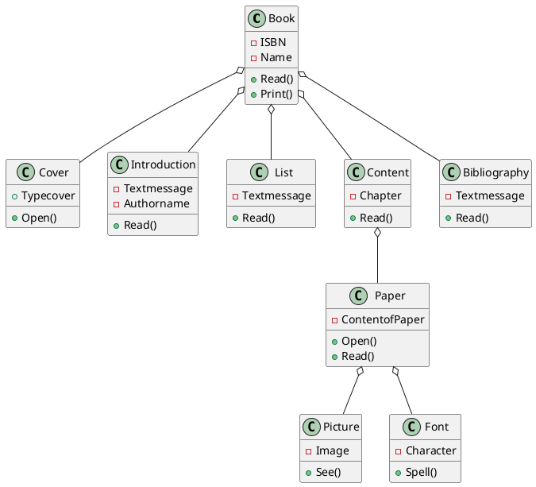

### 2.6 ใช้ plantUML วาดภาพตาม สไลด์หมายเลข 71 ###

### 2.7 ใช้ plantUML วาดภาพตาม สไลด์หมายเลข 76 ###

### 2.8 ใช้ plantUML วาดภาพตาม สไลด์หมายเลข 78 ###

### 2.9 ใช้ plantUML วาดภาพตาม สไลด์หมายเลข 95 ###

---
